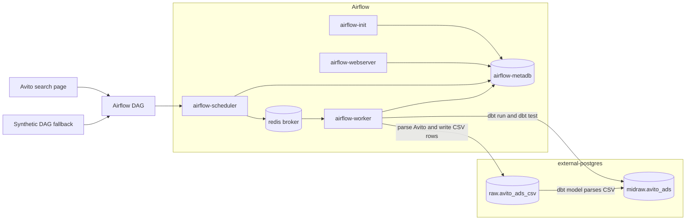

# Avito parser: Airflow -> raw CSV -> dbt midraw

Учебный проект показывает один полный поток данных:

`Avito search page -> Airflow DAG -> raw.avito_ads_csv -> dbt -> midraw.avito_ads`

В ветке оставлен только контур, который относится к Airflow, внешнему Postgres, dbt и Avito parser. Логи Airflow, GUI, Excel-export, Telegram/VK и прочие части исходного парсера убраны.

## Что внутри

- `dags/avito_to_raw_midraw.py` - hourly DAG, который парсит Avito, пишет raw CSV-строки в Postgres и запускает dbt.
- `dags/synthetic_avito_to_raw_midraw.py` - такой же DAG, но вместо Avito создает синтетические объявления. Он нужен, если Avito блокирует запросы или меняет HTML.
- `include/avito_pipeline/` - общий Python-код: парсер, CSV-контракт, запись в Postgres.
- `dbt/` - проект dbt, который переносит CSV-строки из `raw` в нормальную таблицу `midraw.avito_ads`.
- `sql/init_external_postgres.sql` - схемы и raw-таблица во внешнем Postgres.
- `tests/` - быстрые unit-тесты для CSV-контракта и синтетических данных.

## Схема сервисов

Airflow работает в режиме `CeleryExecutor`, поэтому у него разделены роли:

- `airflow-webserver` - UI на `http://localhost:8081`.
- `airflow-metadb` - metadata DB самого Airflow.
- `airflow-scheduler` - читает DAG-и и ставит задачи в очередь.
- `airflow-worker` - забирает задачи из очереди и исполняет Python/dbt шаги.
- `airflow-init` - одноразовая миграция metadata DB и создание пользователя.
- `redis` - брокер очередей Celery между scheduler и worker.
- `external-postgres` - отдельный Postgres проекта, не metadata DB Airflow.



## Запуск

Скопируй пример env и подними сервисы:

```powershell
Copy-Item .env.example .env
docker compose up airflow-init
docker compose up -d
```

Airflow будет доступен на `http://localhost:8081`.

Если нужно несколько воркеров, их можно масштабировать:

```powershell
docker compose up -d --scale airflow-worker=2
```

Логин и пароль:

```text
airflow / airflow
```

Внешний Postgres с данными проекта доступен на `localhost:5433`.

```text
database: avito_dwh
user: avito
password: avito123
```

## Данные в Postgres

В проекте есть два разных Postgres:

- `airflow-metadb` - служебная база Airflow. Там живут DAG runs, task instances, пользователи UI и другая метаинформация Airflow. Для проверки данных парсера ее обычно не трогаем.
- `external-postgres` - отдельная база проекта. Именно туда Airflow пишет raw-данные и именно оттуда dbt строит слой `midraw`.

Подключение к `external-postgres` с хоста:

```text
host: localhost
port: 5433
database: avito_dwh
user: avito
password: avito123
```

Структура данных:

- `raw.avito_ads_csv` - сырой слой. Одна строка таблицы равна одной CSV-строке объявления.
- `raw.avito_load_audit` - аудит загрузок: `run_id`, источник, количество строк, статус.
- `midraw.avito_ads` - типизированный слой dbt. Здесь CSV уже разобран в нормальные поля: `avito_id`, `title`, `price_rub`, `url`, `location`, `seller`, `parsed_at`, `source_system`, `loaded_at`.

Полезные SQL-запросы:

```sql
-- последние raw-загрузки
select
    run_id,
    row_number,
    csv_header,
    csv_row,
    loaded_at
from raw.avito_ads_csv
order by loaded_at desc, row_number
limit 20;

-- аудит запусков
select
    run_id,
    source_system,
    source_url_count,
    row_count,
    status,
    loaded_at
from raw.avito_load_audit
order by loaded_at desc
limit 20;

-- результат dbt midraw
select
    avito_id,
    title,
    price_rub,
    location,
    seller,
    source_system,
    parsed_at,
    loaded_at
from midraw.avito_ads
order by loaded_at desc
limit 20;
```

## Проверка через DBeaver

1. Убедись, что контейнеры запущены:

```powershell
docker compose ps
```

2. В DBeaver создай новое подключение: `Database` -> `New Database Connection` -> `PostgreSQL`.

3. Заполни параметры:

```text
Host: localhost
Port: 5433
Database: avito_dwh
Username: avito
Password: avito123
```

4. Нажми `Test Connection`. Если DBeaver попросит скачать PostgreSQL driver, согласись.

5. После подключения открой:

```text
avito_dwh
  Schemas
    raw
      Tables
        avito_ads_csv
        avito_load_audit
    midraw
      Tables
        avito_ads
```

6. Для быстрой проверки открой SQL Editor в этом подключении и выполни:

```sql
select count(*) as raw_rows from raw.avito_ads_csv;
select count(*) as midraw_rows from midraw.avito_ads;
```

7. Если `raw_rows` больше нуля, а `midraw_rows` равен нулю, значит raw-загрузка прошла, но dbt еще не построил `midraw`. Запусти dbt-шаг через Airflow DAG или вручную:

```powershell
docker compose exec airflow-worker bash -lc "cd /opt/airflow/dbt && dbt run --profiles-dir . && dbt test --profiles-dir ."
```

## Проверка на семпле

Если Avito отвечает нестабильно, запусти синтетический DAG:

```powershell
docker compose run --rm airflow-worker airflow dags test synthetic_avito_to_raw_midraw 2026-07-05
```

Проверить raw CSV-слой:

```powershell
docker compose exec external-postgres psql -U avito -d avito_dwh -c "select run_id, row_number, csv_header, csv_row from raw.avito_ads_csv order by loaded_at desc, row_number limit 5;"
```

Проверить midraw-слой после dbt:

```powershell
docker compose exec external-postgres psql -U avito -d avito_dwh -c "select avito_id, title, price_rub, location, source_system, loaded_at from midraw.avito_ads order by loaded_at desc limit 5;"
```

Запустить dbt вручную:

```powershell
docker compose exec airflow-worker bash -lc "cd /opt/airflow/dbt && dbt run --profiles-dir . && dbt test --profiles-dir ."
```

## Как raw хранит CSV

Raw-таблица хранит одну CSV-строку на объявление:

```sql
raw.avito_ads_csv(
  run_id text,
  row_number int,
  source_url text,
  csv_header text,
  csv_row text,
  loaded_at timestamptz
)
```

`csv_header` фиксирует контракт колонок, а `csv_row` содержит данные в том же порядке. В `midraw` dbt разбирает строку обратно в типизированные поля.

## Настройка Avito

Через `.env` можно поменять:

- `AVITO_SEARCH_URLS` - одна или несколько ссылок через `;`
- `AVITO_MAX_PAGES` - сколько страниц искать, по умолчанию `1`
- `AVITO_REQUEST_TIMEOUT` - timeout HTTP-запроса
- `AVITO_USER_AGENT` - user-agent для запроса

## Локальные тесты

```powershell
python -m unittest discover -s tests
python -m compileall include dags
```

Эти тесты не требуют Docker и не ходят в сеть.
